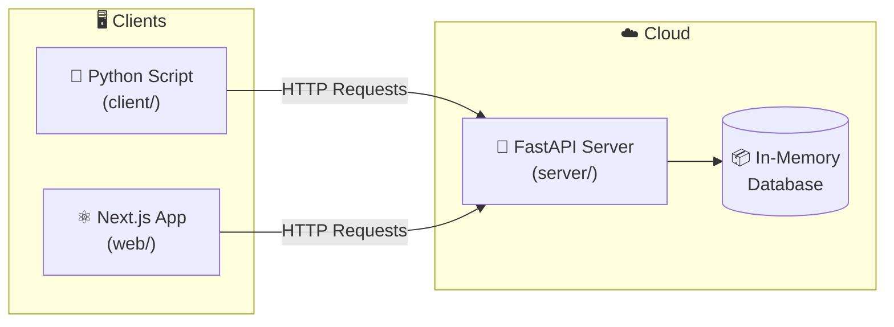
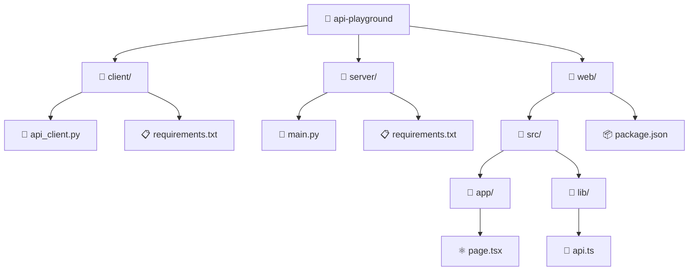
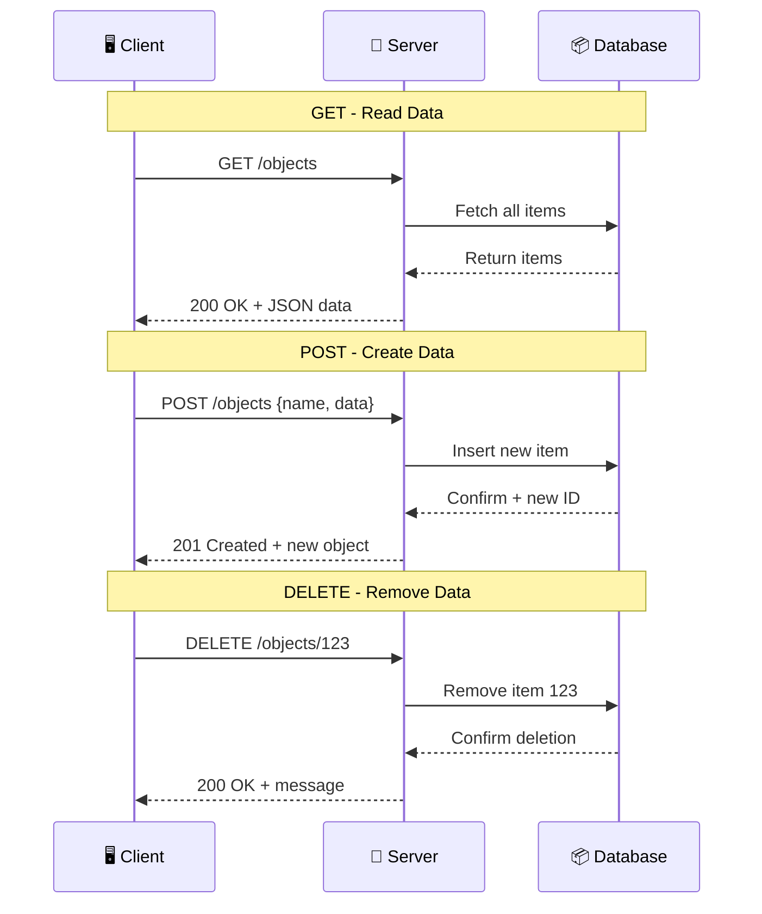
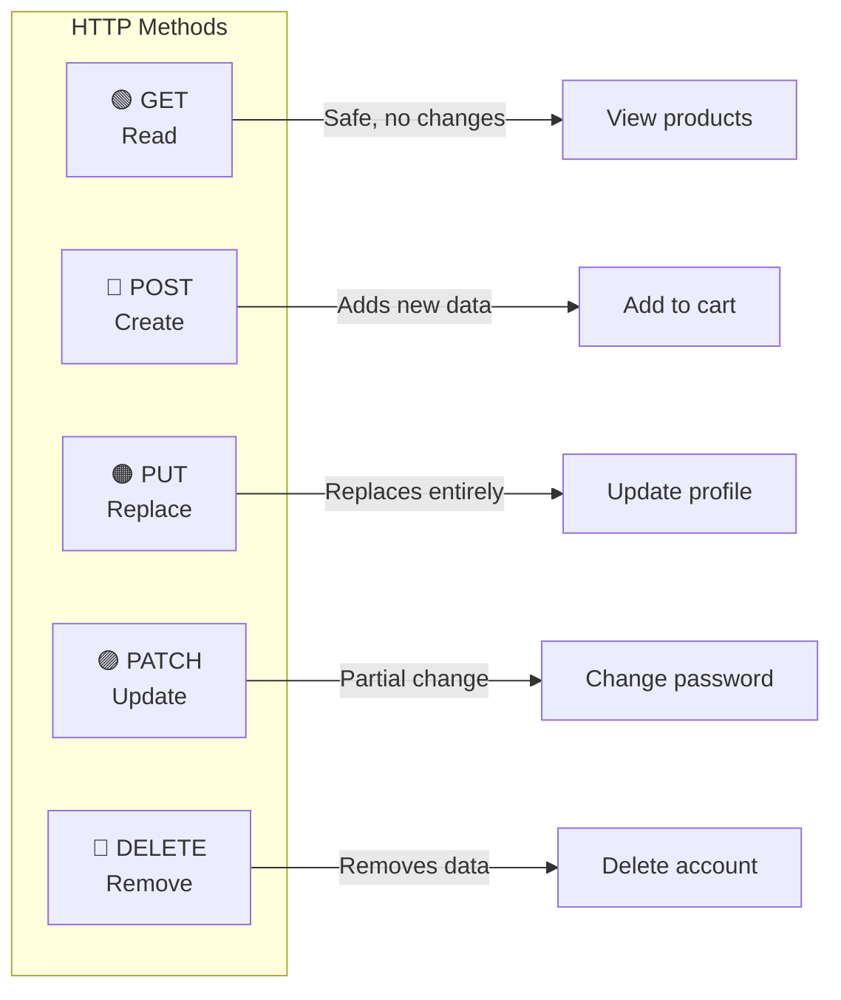
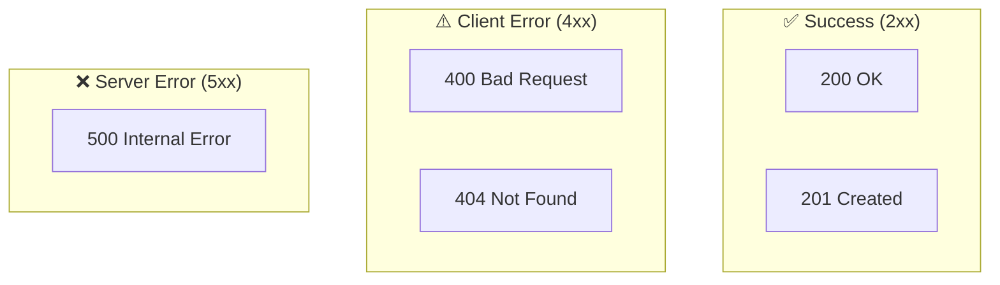
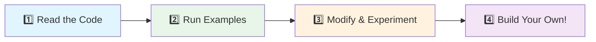

# 🚀 API Playground

Learn how to **create and consume REST APIs** with Python and JavaScript. Perfect for beginners!

## 🌐 Live Demos

| Service | URL | Description |
|---------|-----|-------------|
| **🌐 Web App** | [api-playground-tawny.vercel.app](https://api-playground-tawny.vercel.app) | Interactive Next.js playground |
| **🚀 API Server** | [api-playground-zita.onrender.com](https://api-playground-zita.onrender.com) | FastAPI backend |
| **📚 API Docs** | [/docs](https://api-playground-zita.onrender.com/docs) | Interactive Swagger docs |

## 🏗️ Architecture



## 📂 Project Structure



## 🔧 REST API Flow



## 🎯 HTTP Methods



## 🏃‍♀️ Quick Start

### Prerequisites

- Python 3.10+
- Node.js 18+ and pnpm

### 1. Run the Python Client

```bash
# Set up Python environment
cd client
python3 -m venv venv
source venv/bin/activate  # Windows: venv\Scripts\activate
pip install -r requirements.txt

# Run the demo
python api_client.py
```

### 2. Run the Server Locally

```bash
cd server
pip install -r requirements.txt
python main.py
# Visit: http://localhost:8000/docs
```

### 3. Run the Web App

```bash
cd web
pnpm install
pnpm dev
# Visit: http://localhost:3000
```

## 📡 API Endpoints

| Method | Endpoint | Description |
|--------|----------|-------------|
| `GET` | `/objects` | Get all objects |
| `GET` | `/objects/{id}` | Get single object |
| `POST` | `/objects` | Create new object |
| `PUT` | `/objects/{id}` | Replace object |
| `PATCH` | `/objects/{id}` | Partial update |
| `DELETE` | `/objects/{id}` | Delete object |

## 🚀 Deployment

### Server → Render.com

The `render.yaml` file auto-configures deployment:

```bash
git push origin main
# Then on Render: New → Blueprint → Connect repo
```

### Web App → Vercel ✅

**Already deployed!** Visit: [api-playground-tawny.vercel.app](https://api-playground-tawny.vercel.app)

To deploy your own:
1. Go to [vercel.com/new](https://vercel.com/new)
2. Import `oollet/api-playground`
3. Set **Root Directory**: `web`
4. Deploy!

## 🔢 HTTP Status Codes



## 📚 Learning Path



### Key Files to Study

| File | What You'll Learn |
|------|-------------------|
| `client/api_client.py` | Making HTTP requests with Python |
| `server/main.py` | Building REST APIs with FastAPI |
| `web/src/lib/api.ts` | Fetch API in TypeScript |
| `web/src/app/page.tsx` | React components & state |

## ✅ Progress

- [x] Python API client
- [x] FastAPI server
- [x] Deploy server to Render
- [x] Next.js web app with shadcn/ui
- [x] Deploy web app to Vercel
- [ ] Add authentication
- [ ] Connect to real database

---

Built with ❤️ for learning | [View on GitHub](https://github.com/oollet/api-playground)
